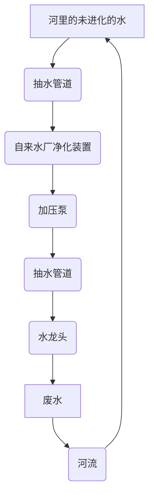
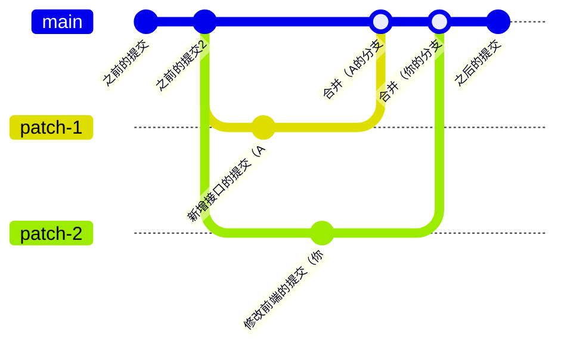

# 写好一个程序

写好一个程序最重要的是学会规范编程
规范编程可以提高代码的可读性、可维护性和可扩展性
换句话说，规范编程可以帮助别人（甚至是自己）快速理解代码的含义，让生产效率变快，同时也可以使软件维护成本降低，或者更快的和其他人对接

在规范编程时需要注意以下几个点：
- 初阶
  1. 缩进 & 空格 & 格式化
  2. 命名
  3. 注释
  4. 文档
- 进阶
  1. 函数 & 类 & 模块化
  2. 单元测试
  3. 异常处理
  4. 版本控制
---
## 初阶
初阶是代码层面的优化，在初阶时我们要求其他开发者们能对代码理解

可以看看这串有关求最大公约数的代码：
```c++
#include<iostream>
class
C1
{public:
	int
	func1(int s,int k) {
			while
	(k !=
	1) { int kyh = k;
			k =s    % k; s
	        = kyh;
	    }
	    return a;}};
	  int main(){
		  C1 qwert;std::cout <<c1. func1(10,
		  15)
		  << endl;
	return 0;
		  		  }
```
和这个：
```c++
#include <iostream>

class GCD {
public:
	int getGCD(int a, int b) {
		// Euclidean algorithm
		while (b != 0) {
			int temp = b;
			b = a % b;
			a = temp;
		}
		
		return a;
	}
};

int main(){
	// Initalize GCD class
	GCD gcd;
	// Output GCD of 10 and 15
	std::cout << gcd.getGCD(10, 15) << endl;
	return 0;
}
```
之间的区别
虽然两者都可以成功被电脑识别编译，运行的结果也是一样的，但是相较于前者，后者更容易被理解

那如何来实现这样的效果呢
### 缩进 & 空格 & 格式化 - Beautifying
格式化代码（beautify）是在书写代码的过程中对代码板书的调整
可以使用适当的缩进和空格来组织代码排版，使代码块清晰可辨

**常见的格式化**:
- 缩进：
  缩进就是在一行代码前加若干个等长的空白（一般一次缩进是4个空格,）
  一般来说，缩进并不会影响代码的运行（一些缩进敏感的编程语言比如Python或YAML除外）
  当需要填写代码块或内嵌代码的时候（比如if或者循环），会使用缩进来表示嵌套关系
  
  举例（一串Python代码）：
	```python
	for i in range(10):
		print("Hello!")
	```
  可以表示为Scratch中的：
  
  
  
  如果有多嵌套，可以使用连续的缩进
	
	```python
	for i in range(10):
    for j in range(10):
  	print("Hello!")
  ```
  可以表示为：
  
  
- 空格 & 换行：
  一般在做一些运算，或用运算符连接数据的时候，会在连接处加空格
  同样的，不加这些空格并不会影响程序运行，但是可以增加代码的可读性
  同时在编写两个部分的代码时，一般会用换行来ID
  举例：
	
	```java
	public class Main {
	    public static void main(String[] args) {
	        int result = 1 + 1;
	        
	        System.out.println("The result of 1 + 1 is: " + result);
	    }
	}
  ```
  在这段代码中，除去必要的空格（连接关键字的空格），` = 1 + 1;`部分的4个空格是可以去掉的，但为了规范，一般会在赋值符`=`或运算符`+`的两边加空格，让代码看起来不会很紧凑
  除此之外，小部分人还会在大量赋值的时候采用缩进达到统一的效果：
	```javascript
	const divMain     = document.getElementById('main');
	const divControls = document.getElementById('controls');
	const divFooter   = document.getElementById('footer');
	const btnSubmit   = document.getElementById('submit-btn');
	const btnCancel   = document.getElementById('cancel-btn');
	const spanStatus  = document.getElementById('status');
	```
### 命名 - Naming
在写代码时，常常会遇到给变量或类成员起名字的时候
我们在起名字的时候要注意命名的规范，这样才可以方便后期的维护

首先，成员、变量、或函数命名需要保证有意义
***注意：尽量不要使用拼音作为名称！！！请使用正确的英文作为名称*** 
正确命名：
`DoneWorkProgress`
错误案例：
`DoWorkProgress` *(容易产设歧义，到底是要做的工作还是做完的工作)*
`DoWorkProgess` *(Progress拼写有误)*
`WanChengGongZuoLiang` *(如果后期需要外国人参与制作，ta有可能会读不懂，就算是中国人也得先拼读一下才能知道是什么意思)*
`完成工作量` *(不要使用Unicode字符，可能会导致编码错误变成乱码)*
`var111` *(不要使用毫无意义的变量名，不然只有上帝和你看得懂，然后你忘了...)*

假设现在需要命名变量: `Foo Bar`
一般来说，命名可以使用以下几种：

| 格式     | 名称     | 描述 |
| :---: | :---: | :---: |
| `foobar`  | 平坦式(Flat Case)          | 全小写                           |
| `FOOBAR`  | 大写式(Upper Case)         | 全大写                           |
| `fooBar`  | 小驼峰(Camel Case)         | 首字母小写，其余每个单词开头字母大写            |
| `FooBar`  | 大驼峰(Pascal Case)        | 每个单词开头字母大写                    |
| `foo_bar` | 蛇形(Snake Case)          | 全小写，每个单词用`_`连接                |
| `FOO_BAR` | 大蛇形(Upper Snake Case)   | 全大写，每个单词用`_`连接                |
| `foo_Bar` | 小蛇峰形(Camel Snake Case)  | 首字母小写，其余每个单词开头字母大写，每个单词用`_`连接 |
| `Foo_Bar` | 大蛇峰形(Pascal Snake Case) | 首字母大写，其余每个单词开头字母大写，每个单词用`_`连接 |
| `foo-bar` | 烤串式(Kebab Case)         | 全小写，每个单词用`-`连接                |
| `FOO-BAR` | 火车式(Train Case)         | 全大写，每个单词用`-`连接                |
| `Foo-Bar` | 未知                      | 首字母大写，其余每个单词开头字母大写，每个单词用`-`连接 |

命名常用的方式是**小驼峰式(Camel Case)**，**大驼峰(Pascal Case)**，**蛇形(Snake Case)**，**大蛇形(Upper Snake Case)**，和**烤串式(Kebab Case)**

对于不同编程语言，有不同的规则：

#### C / C++
- 在C中，库的成员命名基本上是蛇形 *(比如`upper_bound()`)*，最常见的命名是简写和平坦式结合 *(`isalnum` -> is alphanumeric number)*
- 在C++中，命名则基本上是蛇形 *(比如`upper_bound`)*，在定义常量或者宏的时候会用到大蛇形 *(大部分编程语言都这样)*
#### C\#
- 变量，常量，或参数一般使用大驼峰或小驼峰；方法名或类名一般使用大驼峰
- 当使用两个字母的简写时 ，会特别大写简写的字母 *(比如`IOStream`这里特别大写了IO)*。如果简-写字母数较多时，这个特例就不会生效 *(比如`XmlStream`)*
- 接口的名称会在开头加一个大写的`I` *(比如`IEnumerable`)*
- 在命名静态类的时候，一般使用`_`开头的小驼峰命名 *(比如`_doneWorkProgress`)*
- 在遇到定义的名称可能会与关键词同名时，一般在开头加`@` *(比如`@return`)*

Tip: C#的命名一般遵循微软发布的.NET语言指南：[Capitalization Conventions - Framework Design Guidelines | Microsoft Learn](https://learn.microsoft.com/en-us/dotnet/standard/design-guidelines/capitalization-conventions)
#### Go
使用小驼峰或大驼峰命名
#### Java
- 类同C#
- 方法一般使用小驼峰
- 变量同C#，但是`_`或`$`开头的变量一般是不被允许的 (即使可以编译成功)
- 常量同C / C++
#### JavaScript
同Java，但方法使用小驼峰
#### HTML / CSS
一般用烤串式或者其他小写规则来编写id, name, 或class
#### Python
- 以大驼峰作类名
- 以大蛇形作为常量名
- 以蛇形作为其他的命名
- `private`成员一般会以`__`两个下划线开头
#### Ruby
同Python，但`private`成员一般不会以`__`开头
### 注释 - Commenting
一般在编写代码的时候会编写注释，注释并不会被编译器或解析器识别需要执行的代码，相当于单纯给人看的文字，而不真正算是代码

在写代码的时候需要留下注释，帮助后人了解代码的功能
注释不仅要体现代码的功能，还要让读者理解代码在程序中的位置和作用: 
```python
def func(arg1, arg2):
	"""
	功能简介...
	参数介绍：
	- arg1: 介绍...
	- arg2: 介绍...
	返回值:
	介绍...
	示例：
	...
	"""
	
	# 函数体
	
	func2(1, arg2) # 重点标注逻辑难懂，或者容易引起混淆的代码
```

部分人习惯在注释符号前后加一个空格，这样可以让注释看起来不是很紧凑
在有大片注释的时候可以用缩进：
```c++
string str = "";                // declare & initalize str
int n;                          // declare n
cin >> n;                       // input n
for (int i = 0; i < n; i++) {   // repeat n times
	int c;
	cin >> c;
	if (c >= 'A' && c <= 'Z')
		str += ('a' - 'A') + c; // make c lower case if it is upper
	else str += c;              // or directly append it to str
}
cout << str;                    // outout str
```
还有一部分习惯用这种好看的注释方式：
```java
/* This is a comment
 * 每条多行注释开始有一个*号
 * ...
 * 要结束了
 * ...
 */
```
注：大部分IDE拥有快速制作这种注释的快捷键

注意需要及时更新注释
### 文档 - Documenting
在发布软件后，一般会编写文档，一方面是帮助用户使用软件，另一方面可以帮助开发者更快上手编写代码

一般编写文档使用[**Markdown语言**](https://www.markdownguide.org/)，你现在正在看的这份文章就是由Markdown制作的

可以考虑编写[README](https://en.wikipedia.org/wiki/README)或者搭建网站 *(很多博客或者文档的网站都是由免费的[GitHub Pages](https://pages.github.com/)托管，包括这篇文章的网站)*

文档一般分为两个种类，**内部文档**和**外部文档**
**内部文档**一般是内部员工用来理解源代码的 *(一些接口或类的用法)*，这种文档一般包含：
- **管理信息**：用来制定一些规范 *(比如统一的按钮大小，或者命名规则等)*
- **开发者文档**：用来供开发者理解接口或一些用于单元测试的代码 *(后面会讲)*
**外部文档**一般是用来供用户理解软件的用法或者一些软件协议的，这种文档一般包含：
- **[最终用户协议](https://en.wikipedia.org/wiki/End-user_license_agreement)**：EULA, End User License Agreement
- **即时文档**：开发者发布新版本或Release的时候编写的轻量级的更新内容一览，帮助用户快速找到想要的版本
- **软件说明**：帮助用户使用软件，可以添加一些[FAQ](https://en.wikipedia.org/wiki/FAQ)
- **[开源协议](https://en.wikipedia.org/wiki/Open-source_license)**：如果开源，可以写明开源协议
---
## 进阶
进阶是程序层面的优化，在进阶时我们要求程序高性能 *(占空间内存少，速度快)* ，代码设计优秀
### 函数 & 类 & 模块化 - Modularizing
模块是程序的最小单位在面向过程编程中代表一个函数、程序、或算法，在面向对象编程中代表接口或类中的方法；换句话说，模块就是整体代码或系统分割出的各种小块，每个小块实现不同的功能
模块化就是开发者将代码或系统分割为不同小块的过程
模块化设计不仅出现在编程中，同时也在生活中各种地方出现，比如建筑学
举个例子：
下面的图表展示了自然水从河里到水龙头里的过程


在这个过程中，每一个环节都是一个模块，这种模块化的设计方式有以下优点：
- **提升代码质量**：当我们设计好一个模块 *(比如设计好抽水管道)* 后，就可以重复用了。在这个循环中，存在两个抽水管道，如果两个设计要求不一样的，开发时间就需要增加多设计一根管道的时间，这样可以避免重复设计相同的部分，减小程序大小和开发时间
- **降低代码编写的难度**： 一个一个小块做比一次性全做效率高
- 同时，如果整个环节中的一个出现问题，可以不用重新建整个结构或者修改其他模块，而是直接修理故障的模块就好了
- **帮助单元测试** *(后面会讲)*

模块化的设计在面向对象语言和面向过程语言中很重要，程序员通过设计函数或类实现模块化：
- *在C++项目中创建`file_io.h`和`file_io.c`来读取文件*
- *在项目中编写函数`GetGCD()`获取最大公约数*
- *在C#窗体项目中编写`WebAPI`类用来请求网络API*

### 单元测试 - Unit Test
单元测试 *(也叫模块测试)* 是针对模块的测试，一般来说在修改过一次模块代码后都会运行一次单元测试，确保每个模块达到对它预期的要求：
```c#
int CombineNumbers(int a, int b) {
    return a+b;
}
```
*在这个例子中我们定义了一个`CombineNumbers`函数，用来将两个数字相加，假设这个函数就是需要测试的模块*
*`CombineNumbers`的单元测试应该是这样的*
```c#
[TestMethod]
void CombineNumbers_CombineTwoNumbers_ReturnsSum() {
    Assert.AreEqual(CombineNumbers(5, 10), 15);
    Assert.AreEqual(CombineNumbers(1000, -100), 900);
}
```
*`Assert`是你测试框架中的一部分*
*如果`Assert.IsEqual`的两个参数不相等，就无法通过单元测试，抛出异常导致程序测试失败*
*这样可以确保每次编译Release时，`CombineNumbers`在输入5, 10时会输出15，在输入1000和-100时会输出900。如果算法无法达到预期效果就不会被编译成功*

一般编写单元测试时需要遵守以下BCDE原则：
- **Border *(边界)***：测试边界情况，如循环边界、特殊值等
- **Correct *(正确)***：测试正确的输入和期望的输出
- **Design *(设计)***：根据设计文档编写测试，确保实现与设计一致
- **Error *(错误)***：测试错误输入或异常情况，确保系统能够正确处理

单元测试有以下优点：
- **相较于直接运行代码测试功能，单元测试更加方便** *(在编译时就做完了测试)*
- **防止回归出现的Bug**: 回归Bug是在编写完代码后一些老的代码出现了问题，通常在编写完新功能后会需要重新测试老的功能，以防止出现新的bug

优秀的单元测试需要包含：
- **考虑到多种情况**：考虑到一些特殊值 *(比如负数，null，或者0之类的)*
- **命名**：优秀的单元测试一般会在命名中体现出测试的预期，这样可以快速体现出测试的目的，一般会包含：
  - *需要测试的方法*
  - *如何测试 (比如输入参数)*
  - *预期结果 (输出值、抛出异常等)*
  比如`Add_SingleNumber_ReturnsSameNumber`，而非`Test_Single`
- **将代码分为三部分**：明确地将三部分区分开；降低混淆的可能性
  - *Arrange*: 负责初始化测试实例
  - *Act*: 负责计算并取得测试值
  - *Assert*: 判断测试结果
  将三部分用注释标注出来
- **避免引用依赖**：引用依赖会大幅度降低测试效率，可以尝试[注入依赖](https://learn.microsoft.com/en-us/dotnet/core/extensions/dependency-injection)
- **尽量精简的编写测试**：尽量将测试中需要通过的样本数量减少，尽量取特殊值和平时可能的数据
- **避免[Magic String](https://en.wikipedia.org/wiki/Magic_string)**：有关避免Magic String的更多，参考[Magic Strings | DevIQ](https://deviq.com/antipatterns/magic-strings)；考虑提前定义字符串，方便后人快速理解：
  ```c#
  [Fact]
  void Add_MaximumSumResult_ThrowsOverflowException()
  {
	  // Arrange
	  var stringCalculator = new StringCalculator();
	  const string MAXIMUM_RESULT = "1001"; // 定义Magic string，而不是直接在下面
	  
	  // Act
	  Action actual = () => stringCalculator.Add(MAXIMUM_RESULT); // 在这里插入
  
	  // Assert
	  Assert.Throws<OverflowException>(actual);
  }
  ```
- **避免逻辑**：避免手动编写`for`、`while`、`if`之类的逻辑，取而代之请使用框架封装的方法来判断：
```c#
  [Theory]
  [InlineData("0,0,0", 0)]
  [InlineData("0,1,2", 3)]
  [InlineData("1,2,3", 6)] // 避免使用for循环
  public void Add_MultipleNumbers_ReturnsSumOfNumbers(string input, int expected)
  {
	  var stringCalculator = new StringCalculator();
	  var actual = stringCalculator.Add(input); Assert.Equal(expected, actual);
  }
```
### 异常处理 - Exceptions Handling
软件是给用户用得，当软件出现故障时，需要让用户明白发生了什么、该怎么做，而不是抛一堆代码给用户体会，或者什么都不做卡在那里

优秀的异常处理案例：


*Windows最知名的错误提示: [BSoD](https://en.wikipedia.org/wiki/Blue_screen_of_death)(蓝屏死机)，会在系统层驱动或系统发生问题时显示。BSoD上标注了错误原因、系统的采取措施、和可能的处理方式，同时给出了错误代码，方便用户向开发者询问 (虽然没有多少人会去真正读它*

反面教材《任务成功地失败了》:


简单的C#异常处理
```c#
try{
	// 运行代码
}
catch (Exception ex){
	MessageBox.Show(
		"在...期间遇到了问题: " + // 说明问题是在哪里发生的
		ex.Message +            // 给出错误原因
		"\n可能是因为..." +      // 给出可能的原因
		"\n请尝试...",          // 给出可能的解决方法
		"发生错误", MessageBoxButtons.OK, MessageBoxIcon.Error //弹窗标题，图标和按钮
	);
}
```

**注意：一定要在可能出现异常的地方加上try**

**Tip: 现代IDE或者官方文档一般会说明方法可能抛出的异常：**


*IDE和文档写明方法`StreamReader.ReadToEnd`可能抛出`OutOfMemoryException`或`IOException`*

### 版本控制 - Version Control
版本控制也被称为*源代码管理*，或*源控制*
**版本控制相当于每做一个功能就备份一次代码**，这样如果哪个功能做废了可以一键回退；同时版本控制可以保证团队合作的源不冲突，换句话说：
假设你正在制作一个多人合作的项目，你需要你的同事A做一个模块，然后你会在前端接入这个模块，于是你向A发了一份你正在编写的源代码，A在收到后立刻就开始工作了
但是第二天你发现，之前写的若干个前端代码调用的接口不对，你需要修改代码才能让他们运作
你很快就修好了前端的代码，同时A也写好了接口，但是此时你们发现一个问题：

- A电脑上的版本缺少你当天修改的前端接口，你电脑上同时也缺少A刚写出来的接口

- 可以直接合并新的文件，但是不确定修改了那些（有若干个被修改的

- 直接拷贝覆盖，有一方的新代码就会被覆盖
  这里描述的冲突如图：
  

  两方都有新的文件，而且不能确定哪些是新增的，所有文件都混在一起

但如果是使用的Git进行开发，可以直接合并两个分支，假设A的版本叫patch-1，你的分支叫patch-2，那么只需要几行指令就可以了：
```bash
git checkout main    # Checkout主分支，也就是未修改的版本
git merge patch-1    # 合并两个分支，并进行一次commit，会自动进行合并
git merge patch-2    # 合并
git push origin main # 将新的main推送到存储库
```

在Git图像中是这样的：



*patch-1是A的分支，patch-2是你的分支*

如上文提到的，可以用[Git](https://git-scm.com/)这个工具进行版本控制，然后快速实现合并的操作

**版本控制是多人合作或者大型项目重要的一环**，通过创建远程仓库可以将代码托管在云端，一些网站比如最有名的[GitHub](https://www.github.com)、[GitLab](https://www.gitlab.com/)等都是负责托管Git仓库的

---

## 总结
在写好一个程序这个问题上，代码层面的规范编写和程序层面的规范编写同样重要，如果两部分都能达到相应的要求，就能写好一个程序

## 参考文献
- [Naming convention (programming) - Wikipedia](https://en.wikipedia.org/wiki/Naming_convention_(programming))
- [What is Software Documentation? Definition, Types and Examples (techtarget.com)](https://www.techtarget.com/searchsoftwarequality/definition/documentation#:~:text=In%20the%20software%20development%20process%2C%20software%20documentation%20is,as%20online%20versions%20of%20manuals%20and%20help%20capabilities.)
- [The Importance of Modular Programming (aist.global)](https://aist.global/en/importance-of-modular-programming)
- [Best practices for writing unit tests - .NET \| Microsoft Learn](https://learn.microsoft.com/en-us/dotnet/core/testing/unit-testing-best-practices)
- [Version control - Wikipedia](https://en.wikipedia.org/wiki/Version_control)
- [What is unit testing and how do you do it? - Stack Overflow](https://stackoverflow.com/questions/652292/what-is-unit-testing-and-how-do-you-do-it)